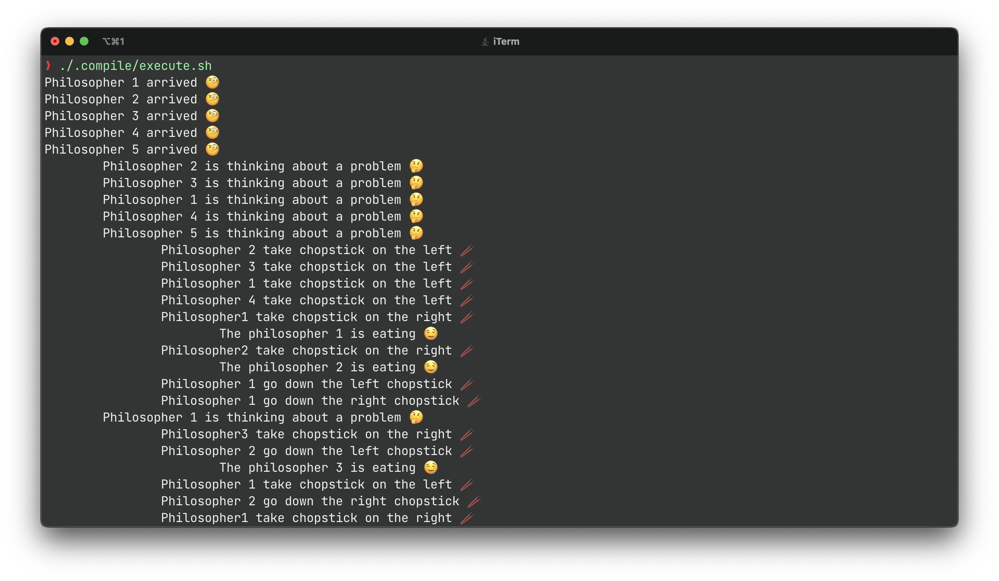
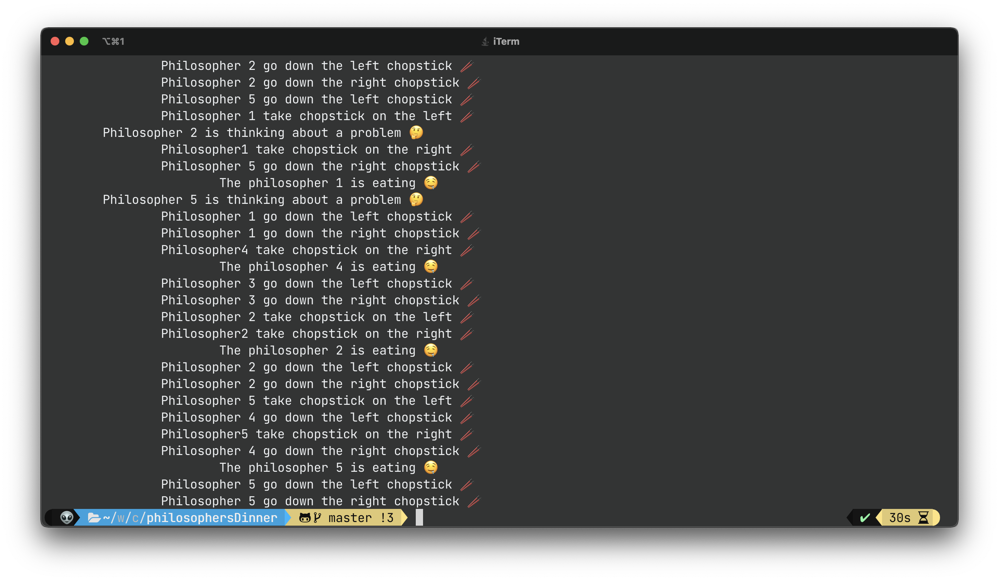

# THE PHILOSOPHERS 'DINNER

This a personal program for my class of concurrent programing 

Imagine five philosophers who spend their lives just thinking and eating. They know
they sit around a round table with five chairs. The table has a plate
big of rice. However, there are only five chopsticks available,
as the picture shows. Every philosopher thinks. When he feels hungry
he sits down and takes the two chopsticks closest to him. If a philosopher could
take both chopsticks, he can eat for a moment. After a philosopher
finish eating, put down the chopsticks and go back to thinking.

1. Write a program that simulates the behavior of philosophers, in the
where each philosopher is a thread and the chopsticks are shared objects. I feel that
should prevent a situation where two philosophers take the same toothpick when
Same time.
2. Make your program in such a way that it never reaches a state where the
philosophers are deadlocked, that is, never be the case
in which each philosopher has a toothpick and is stuck waiting for another to
be able to take the second toothpick.
3. Make your program in such a way that no philosopher is hungry
(Starvation).

## How to execute?

> ⚠️  Note if you can't compile the program, delete the emojis

### MacOs/Linux 

```bash 
./.compile/compiler.sh
```

```bash 
./.compile/execute.sh
```

### Windows

```bash 
./.compile/compiler.bat
```

```bash 
./.compile/execute.batA
```
### OUTPUT 



